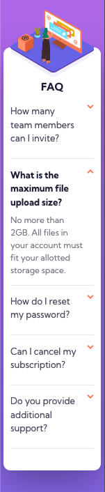
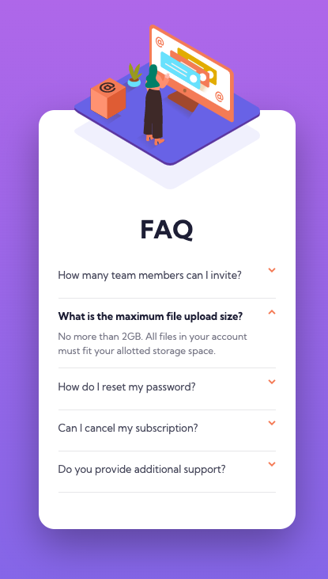
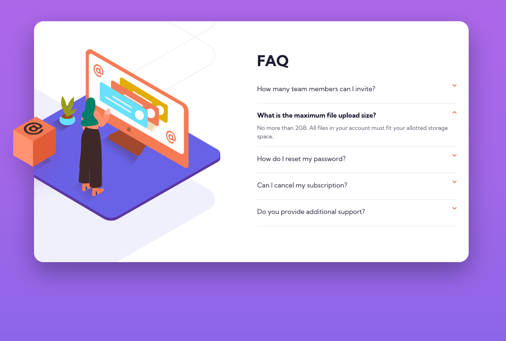

# Frontend Mentor - FAQ accordion card solution

This is a solution to the [FAQ accordion card challenge on Frontend Mentor](https://www.frontendmentor.io/challenges/faq-accordion-card-XlyjD0Oam). Frontend Mentor challenges help you improve your coding skills by building realistic projects.

## Table of contents

- [Overview](#overview)
  - [The challenge](#the-challenge)
  - [Screenshot](#screenshot)
  - [Links](#links)
- [My process](#my-process)
  - [Built with](#built-with)
  - [What I learned](#what-i-learned)
  - [Continued development](#continued-development)
  - [Useful resources](#useful-resources)
- [Author](#author)

## Overview

### The challenge

Users should be able to:

- View the optimal layout for the component depending on their device's screen size
- See hover states for all interactive elements on the page
- Hide/Show the answer to a question when the question is clicked

### Screenshot

Watch (Mini Display) Design

Mobile Design

Desktop Design

### Links

- Solution URL: [https://github.com/kennbach/faq-accordion-card](https://github.com/kennbach/faq-accordion-card)
- Live Site URL: [https://kennbach.github.io/faq-accordion-card/](https://kennbach.github.io/faq-accordion-card/)

## My process

### Built with

- Semantic HTML5 markup
- CSS Variables
- CSS Grid
- Vanilla JavaScript
- Mobile-first workflow
- Accessibility Aware

### What I learned

This project had a good challenge to arrange the svg's. So I tried to apply a style for a watch too, just to get some more experience.

I got caught out with the box svg in the desktop style. The other two images need to have overflow hidden, but the box needed to overflow. I made life a little more difficult by not using the first two as background images and then letting the box overflow. But I hacked my way through it, though I won't make that mistake again.

### Continued development

I played a lot with transform and translate on this project. Positioning outside of basic html, grid, and flexbox is a weakness. I made a lot of progess with those skills on this project, but will continue to learn more of the tricks that will save a lot of time in the future.

### Useful resources

- [The Net Ninja: HTML & CSS Crash Course](https://youtube.com/playlist?list=PL4cUxeGkcC9ivBf_eKCPIAYXWzLlPAm6G) - This is a great resource to learn or refresh your HTML and CSS knowledge from the ground up.

- [The Net Ninja: CSS Variables](https://youtube.com/playlist?list=PL4cUxeGkcC9ii5PB2UMyYH7QFZWfGnVgZ) - This is a great resource to learn CSS variables.

- [The Net Ninja: CSS Grid](https://youtube.com/playlist?list=PL4cUxeGkcC9itC4TxYMzFCfveyutyPOCY) - This is a great resource to learn CSS grid.

- [Kevin Powell: Are you using the right CSS units?](https://youtu.be/N5wpD9Ov_To) - There are a lot of different units that we can use when writing CSS, in this video Kevin gives some general rules of thumb of which ones are best suited for which situations. This is also where I learned how to convert the root font-size to base-10.

- [Kevin Powell: Solutions to common struggles](https://www.youtube.com/playlist?list=PL4-IK0AVhVjMbyomzxwNOECQwioJLxX6n) - The title says it all.

- Both, [Kevin Powell](https://www.youtube.com/kepowob) and [The Net Ninja](https://www.youtube.com/c/TheNetNinja) have a virtual-ton of great web app development tutorials. I only listed a few above, but there are many, many more.

## Author

- Github - [kennbach](https://github.com/kennbach)
- Frontend Mentor - [@kennbach](https://www.frontendmentor.io/profile/kennbach)
